# _index — 参考图清单

> LLM 可读。每行 = 一张图。`grep "关键词" _index.md` 快速定位。
> 新增图片时追加一行。晋升 `assets/` 后移除对应行。

## 字段

| 字段 | 含义                                                                                             |
| ---- | ------------------------------------------------------------------------------------------------ |
| ID   | 文件名 + 缩略图预览                                                                              |
| T    | 类型：CHR角色 / SCN场景 / KV官方视觉 / LYT布局模板                                               |
| 内容 | 角色名或场景名                                                                                   |
| 视角 | front/3:4/full/sheet(多视图)/wide/close                                                          |
| 用途 | id(身份锚定)/outfit(服装)/color(配色)/scene(场景定调)/layout(布局参考)/style(风格)/neg(负面参考) |
| 源   | web来源域名 或 "ai:Seedream"                                                                     |
| 质量 | 分辨率短边px / 清晰度(H/M/L) / 遮挡(Y/N)                                                         |
| 描述 | 一行摘要                                                                                         |

## 清单

| ID | T | 内容 | 视角 | 用途 | 源 | 质量 | 描述 |
|----|----|------|------|------|----|------|------|
| 001_char_identity_YhwachPapercraft_v01.png  | CHR | Yhwach | full | layout+id | cdn.supercoloring.com | 815/M/N | 同人纸模展开图，体态比例参考 |
| 001_scene_identity_BleachCour3KeyVisual_v01.jpeg  | KV | TYBW Part 3 KV | wide | scene+color | epicdope.com | 511/L/Y | Part 3 主KV，Wahrwelt+角色群像全景定调 |
| 002_keyvisual_TYBW_Part2_Yhwach_Uryu_v01.jpg  | KV | Yhwach+Uryu | 3:4 | id+outfit+color | animecorner.me | 1080/H/N | Part 2 主KV，Yhwach 傲慢表情+服装定调 |
| 003_scene_look_WahrweltPalace_v01.webp  | SCN | Wahrwelt Palace | wide | scene+color | boomzappow.com | 576/M/N | Wahrwelt 冰宫外观仰拍，逆光哥特尖塔 |
| 004_scene_TYBW_Part3_IchigoYhwach_v01.jpg  | SCN | Ichigo vs Yhwach | 3:4 | scene+color | otakuusamagazine.com | 630/M/N | Part 3 战斗场景，暖金黄强光+碎石对峙 |
| 004_scene_look_YhwachWahrwelt_v01.webp  | SCN | Yhwach@Wahrwelt | full | scene+color | boomzappow.com | 576/M/N | Yhwach 立于冰宫前，品红主调+黑蓝背景 |
| 005_scene_identity_TYBWCalamity_Yhwach_v01.jpg  | KV | Yhwach (Calamity) | 3:4 | scene+color | otakuusamagazine.com | 557/M/N | Calamity 主KV，Yhwach 灵王形态半身 |
| 005_scene_look_SeireiteiRuins_v01.webp  | SCN | Seireitei Ruins | wide | scene+color | boomzappow.com | 576/M/Y | 瀞灵廷废墟+Gotei13，末日余烬暖灰紫 |
| 006_scene_identity_TYBWFinalSeason_v01.jpg  | KV | TYBW Final Season | wide | scene+color | otakuusamagazine.com | 675/M/Y | 最终季宣布KV，暗红棕末日氛围 |
| 006_scene_look_IchigoWahrwelt_v01.webp  | SCN | Ichigo@Wahrwelt | full | scene+color | boomzappow.com | 576/M/N | Ichigo 降临 Wahrwelt，淡紫灰冷调 |
| 007_scene_look_CalamityTrailer_v01.jpg 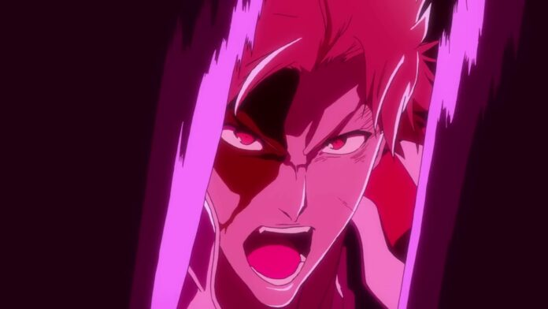 | SCN | Calamity Trailer | wide | scene+color | 新闻站点 | 392/L/N | Calamity 预告定场，深洋红末日调 |
| 008_scene_identity_CalamityTheatrical_v01.jpeg 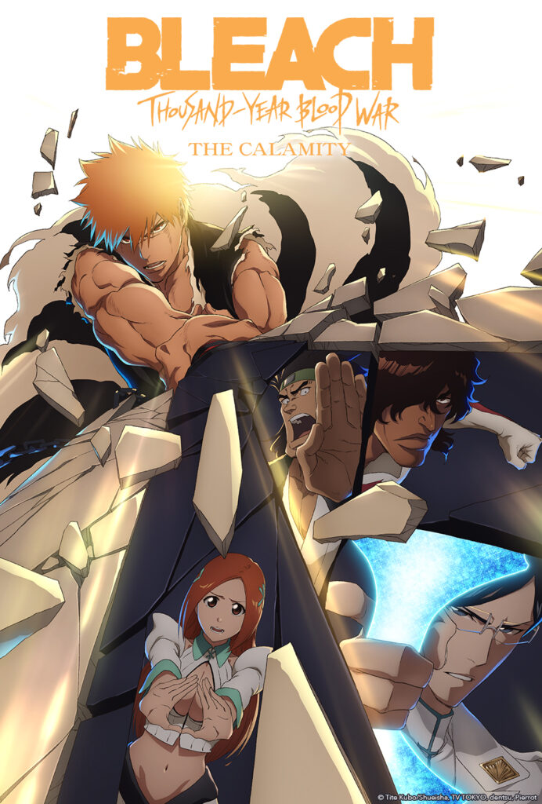 | KV | Calamity Theatrical | front | scene+color | animetv-jp.net | 692/M/N | 剧场版主视觉，竖版角色+抽象崩解背景 |
| 010_scene_look_full_gotei-13_v01.webp 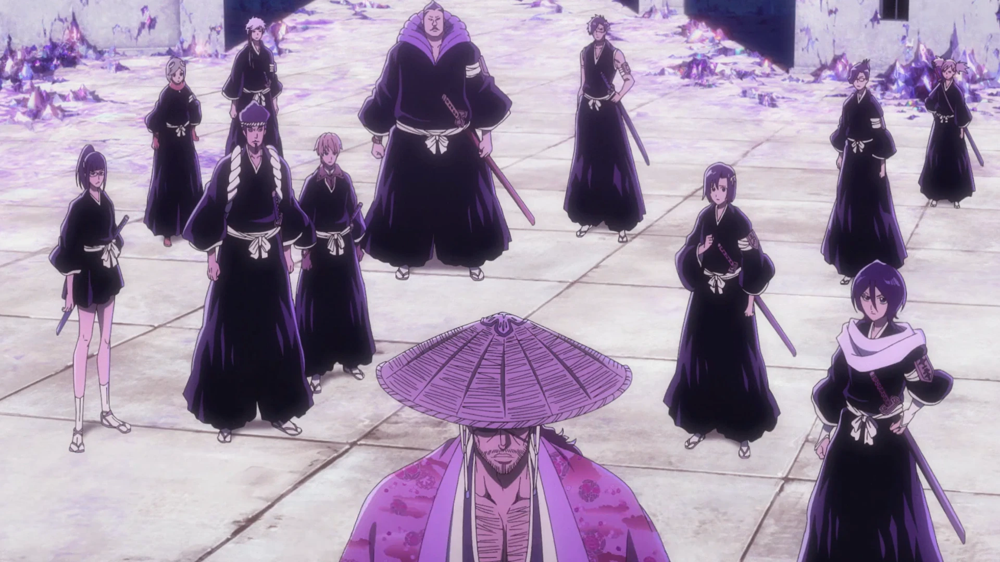 | SCN | Seireitei+Gotei13 | wide | scene+color | boomzappow.com | 1080/H/N | 瀞灵廷废墟全景，Gotei13一字排开+建筑损毁 |
| 010_scene_look_full_ichigo_v01.webp 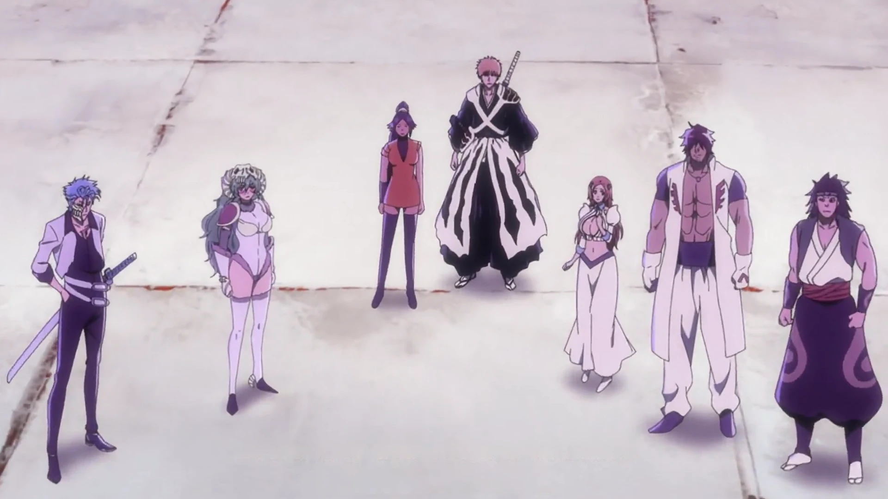 | SCN | Ichigo@Wahrwelt | full | scene+color | boomzappow.com | 1080/H/N | Wahrwelt 冷调全尺寸，Ichigo居中+冰宫天际线 |
| 010_scene_look_full_wahrwelt_v01.webp  | SCN | Wahrwelt | wide | scene+color | boomzappow.com | 1080/M/N | Wahrwelt 纯场景全尺寸，冰晶宫殿群定焦 |
| 010_scene_look_full_yhwach_v01.webp  | SCN | Yhwach@Wahrwelt | full | scene+color | boomzappow.com | 1080/H/N | Yhwach+Wahrwelt 全尺寸最佳单张，品红暗调 |
| 011_scene_look_CalamityTrailerFull_v01.jpg 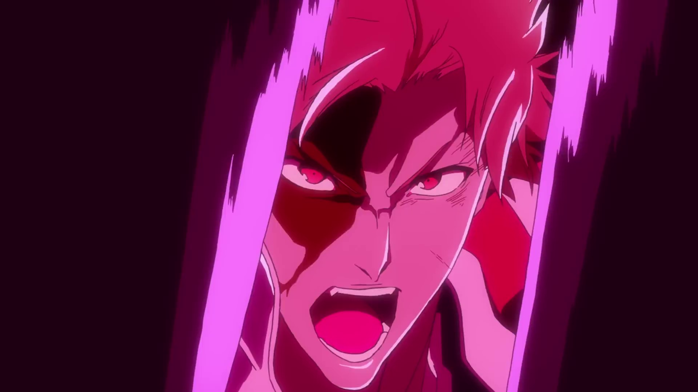 | SCN | Calamity 预告 | wide | scene+color | 官方预告 | 1080/H/Y | Calamity 预告崩坏，深洋红+爆炸光源+碎片 |
| 012_scene_look_TYBWBlogHero_v01.jpg 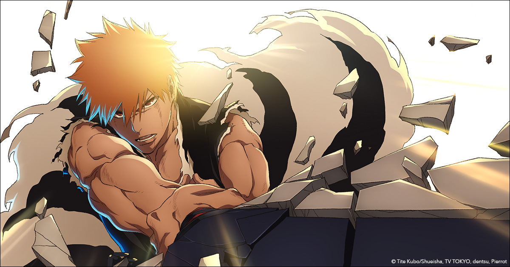 | KV | TYBW Blog Hero | wide | scene+color | cloudfront.net | 630/H/Y | TYBW 全篇主视觉横幅，Ichigo+Yhwach对峙剪影 |
| 013_scene_look_Part4Blog_v01.jpg 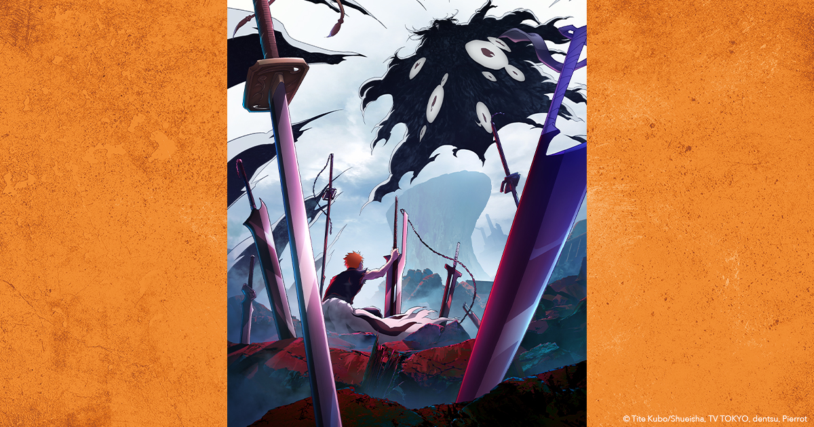 | KV | Part 4 Blog Hero | wide | scene+color | cloudfront.net | 630/H/N | Part 4 博客横幅，暖橙棕末日黄昏调 |
| 014_scene_look_TYBWTeaser_v01.jpg 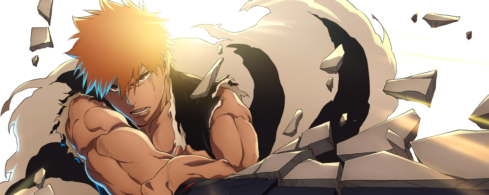 | KV | TYBW Teaser | wide | scene+color | cloudfront.net | 800/H/N | 早期Teaser超宽幅，史诗开幕暖棕调 |
| 015_scene_look_Ep32Screenshot1_v01.png 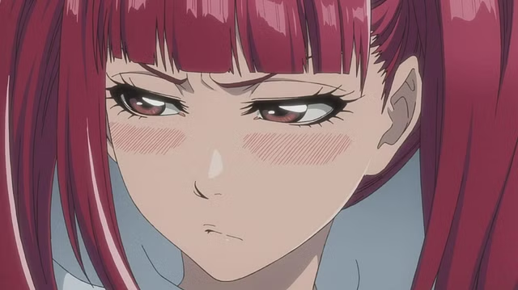 | SCN | Ep32 Wahrwelt 形成1 | close | scene+color+style | animeignite.com | 359/M/N | Wahrwelt 形成瞬间，冰晶凝结+暖紫红特效 |
| 016_scene_look_Ep32Screenshot2_v01.png 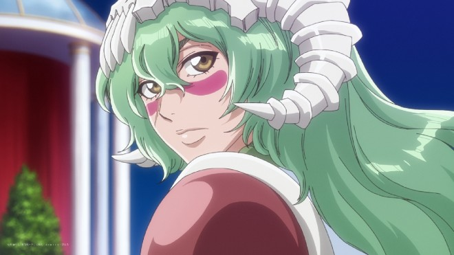 | SCN | Ep32 Wahrwelt 形成2 | wide | scene+color | animeignite.com | 371/M/N | Wahrwelt 形成中期，灰蓝调+半成型冰晶 |
| 017_scene_look_Ep32Screenshot3_v01.png  | SCN | Ep32 冰晶特写 | close | color+style | animeignite.com | 512/M/N | 冰晶结构特写，深紫灰冷色+几何切面 |
| 018_scene_look_Ep32Screenshot4_v01.png 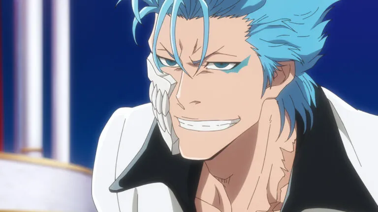 | SCN | Ep32 Wahrwelt 远景 | wide | scene+color | animeignite.com | 432/M/N | Wahrwelt 远景构图，灰蓝冷静+开阔平台 |
| 019_scene_look_Ep32Full_v01.png 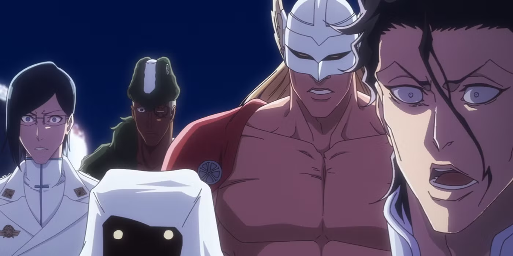 | SCN | Ep32 Wahrwelt 全景 | wide | scene+color | animeignite.com | 700/M/N | Wahrwelt 形成全景+Yhwach，深紫灰+冰晶发光 |
| 020_scene_look_EpYhwach_v01.jpg 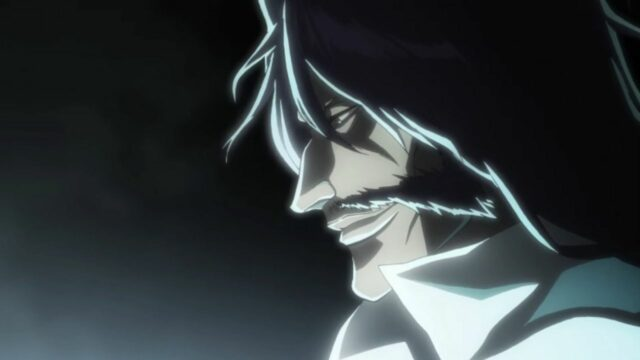 | SCN | Yhwach 中景 | close | id | 新闻源转载 | 360/L/N | Yhwach 暗调环境姿态，冷灰蓝+神态参考 |
| 021_scene_look_TYBWFeatured1280_v01.jpg 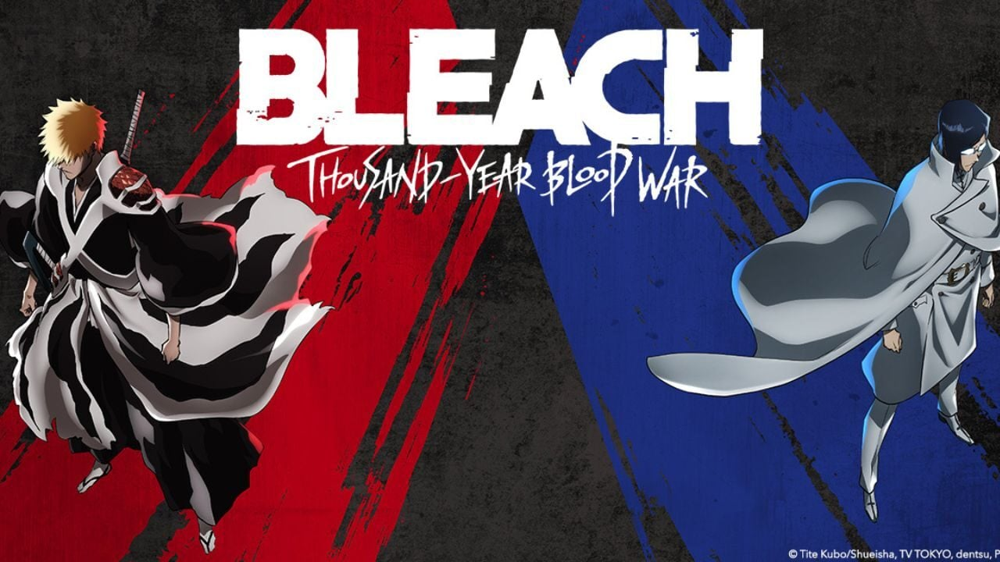 | KV | TYBW 主视觉 | wide | scene+color | epicdope.com | 720/H/Y | TYBW 主视觉，角色群像+紫灰调+建筑剪影 |
| 022_scene_identity_CalamityKeyVisual_v01.jpg 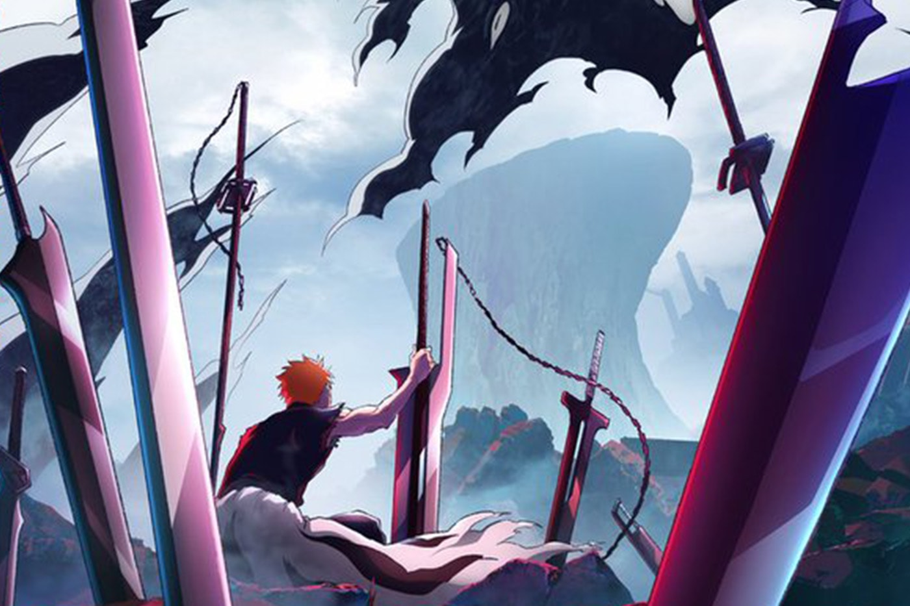 | KV | Calamity KV | front | scene+color | hypb.st | 933/H/N | Calamity 官方主视觉，冷紫灰+崩解+角色居中 |
| 023_scene_look_CalamityTheatricalRelease_v01.jpg 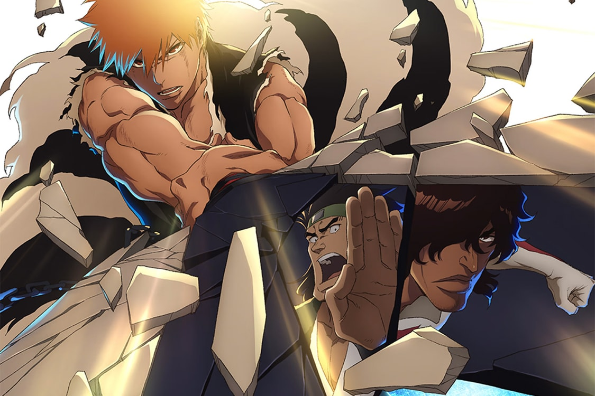 | KV | Calamity 剧场版 | front | scene+color | hypb.st | 750/H/N | 剧场版上映宣传，暖棕+金色光晕+角色居中 |
| 024_scene_look_CalamityTrailerStill_v01.jpg 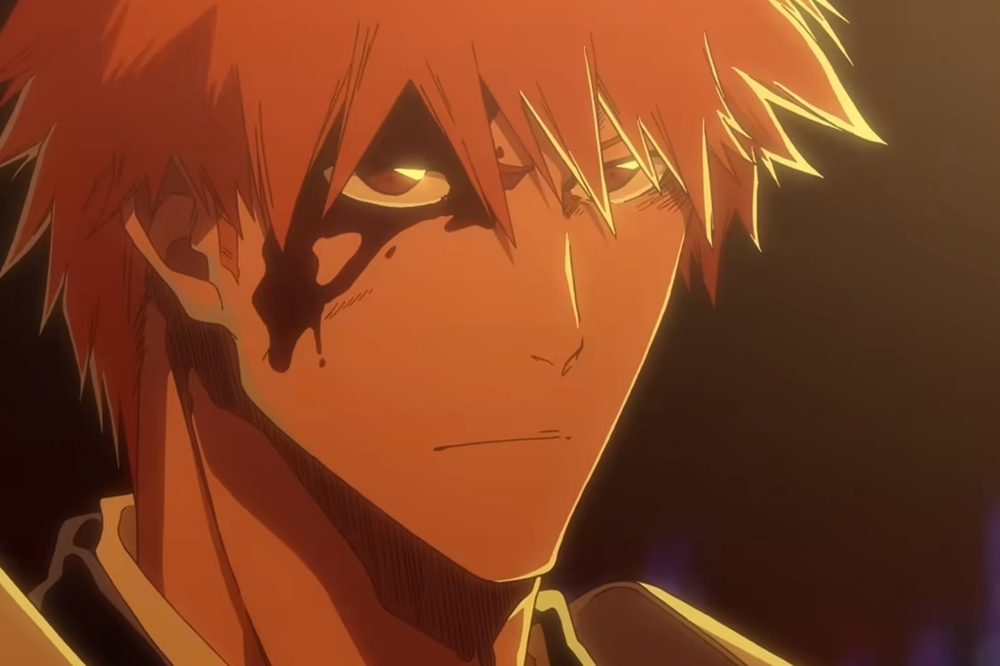 | SCN | Calamity 预告 | close | scene+color | hypb.st | 750/H/Y | 预告爆发段落，橙棕+金色能量爆炸+碎片 |
| 025_scene_look_Part4Release_v01.jpg 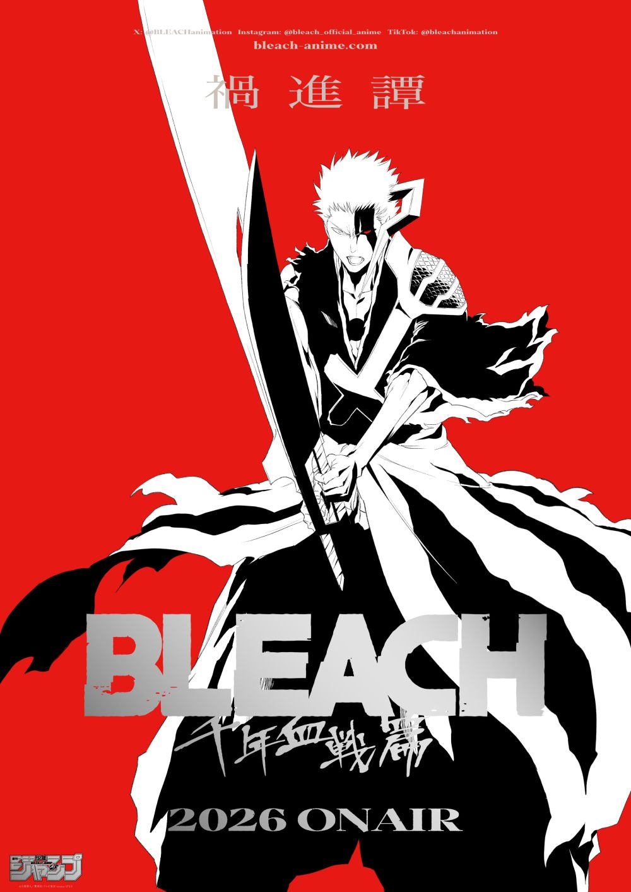 | KV | Part 4 Release | front | scene+color | slushtimes.com | 1000/H/N | Part 4 发布宣布竖版，暖红调+角色居中 |
| 026_scene_identity_Part4Announced_v01.jpeg 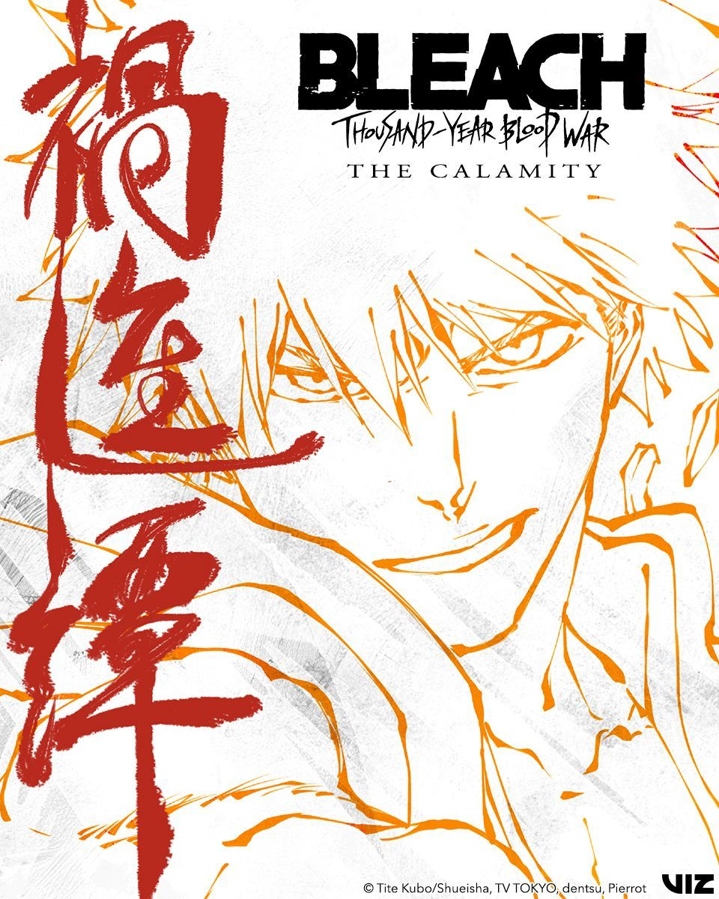 | KV | Part 4 Announced | front | color+id | slushtimes.com | 960/H/N | Part 4 宣布视觉，最亮暖米白+角色清晰 |
| 027_lyt_layout_ThreeColumnCharSheet_v01.png  | LYT | 三栏布局模板 | sheet | layout | ai:Seedream | 1440/H/N | 三栏角色设计稿：左肖像+中3/4面+右全身。布局参考用 |
| 029_char_look_YhwachFullBody_v01.png 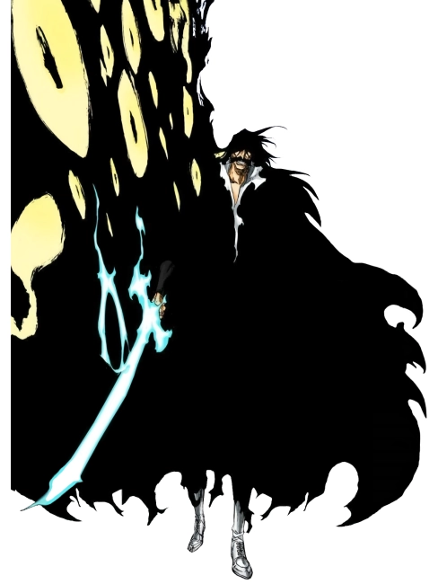 | SCN | Yhwach | 3:4 | outfit | 用户提供 | 488/L/N | 全身半边特写，白风衣+暗红披风+黑手套完整服装参考 |
| 030_char_identity_YhwachLineArtMultiView_v01.png 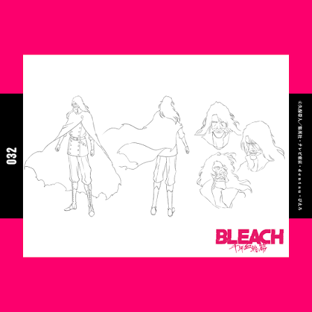 | CHR | Yhwach | sheet | id | 用户提供 | 447/L/N | 多视图面部线稿：正面+侧面+斜侧。胡须结构+眼窝+无眉精确锚定 |
| 031_char_look_IchigoFullBody_v01.png 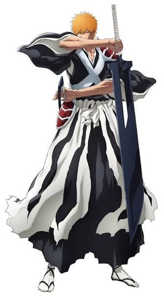 | CHR | Ichigo | full | outfit | 用户提供 | 333/L/N | 全身二刀流立绘：大型斩月+短刃，黑色死霸装+红色系带 |
| 032_char_identity_IchigoFaceExpressions_v01.png 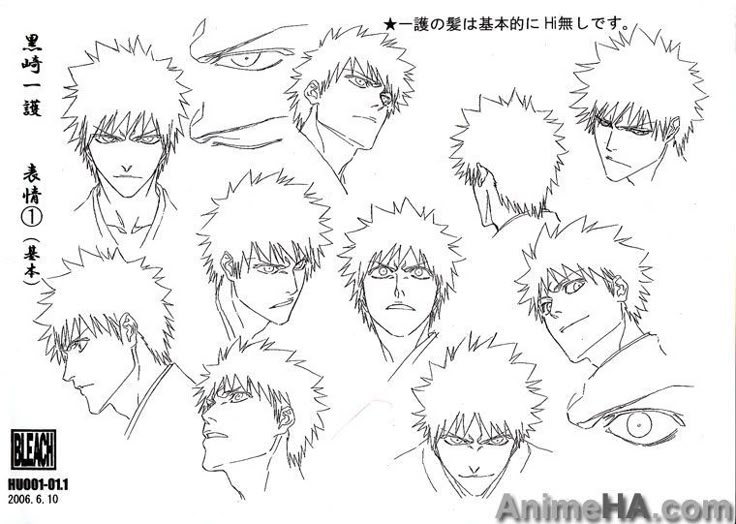 | CHR | Ichigo | sheet | id | 用户提供 | 524/L/N | 头部表情特写集：多角度+多表情面部参考，橙发棕瞳 |
| 033_char_identity_YhwachOfficialFull_v01.png 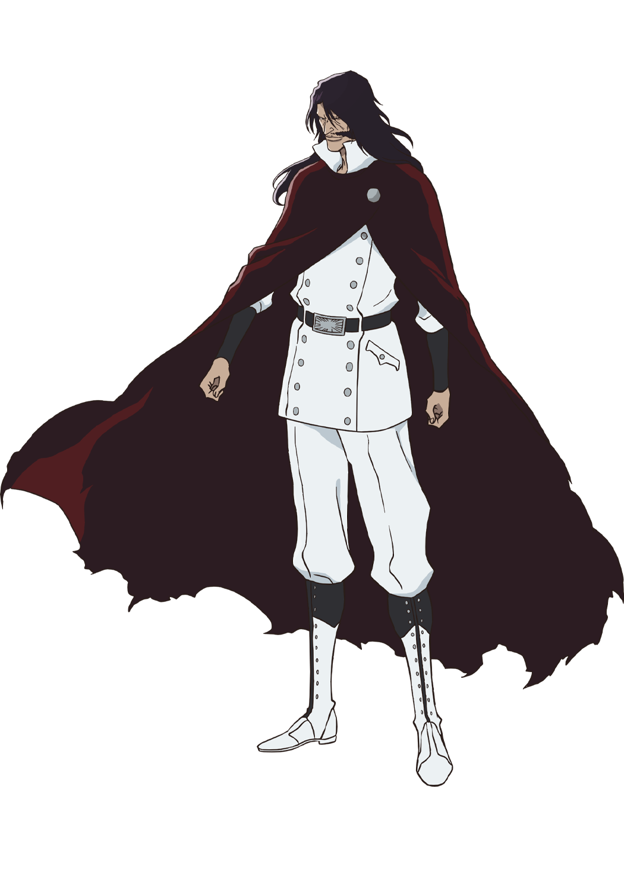 | CHR | Yhwach | full | id+outfit+color | bleach-anime.com | 1050/H/N | **P0 官方**全身立绘：白风衣+十字徽章+暗红披风+多瞳红瞳。首个满足1024px门槛的官方源 |
| 034_char_identity_YhwachOfficialFace_v01.png 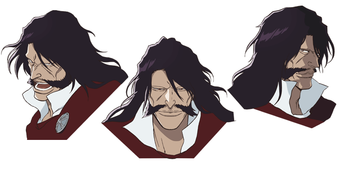 | CHR | Yhwach | front | id | bleach-anime.com | 340/L/N | **P0 官方**表情图：多瞳结构+络腮胡+无眉眉骨 |
| 028_char_Yhwach_canonical_v02.png 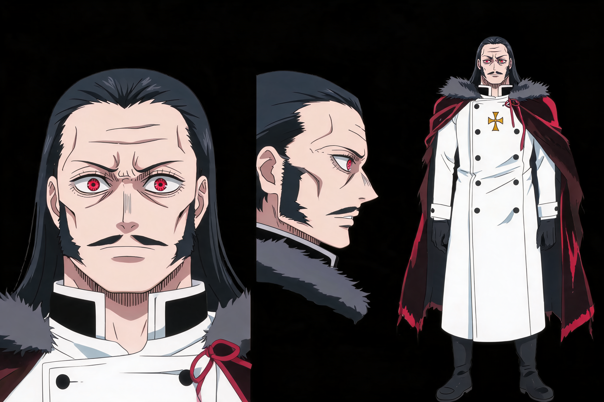 | CHR | Yhwach | sheet | id+outfit | ai:Seedream | 1600/H/N | v2 3:2 landscape three-column character sheet: front portrait + 3/4 profile + full body. 3 ref images (030 face line art + 027 layout + 010 clothing). IaD neutral expression, black background. ~800px per column
| 035_char_identity_YhwachCanonical_v01.png 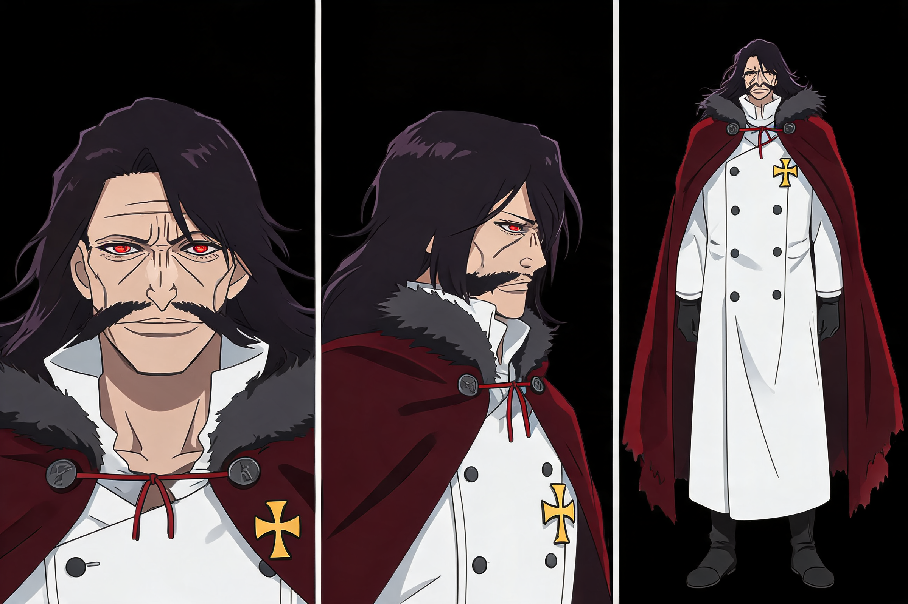 | CHR | Yhwach | sheet | id+outfit | ai:Seedream | 1600/H/N | v3 3:2 three-column character sheet: 033+034+027 refs. IaD 5/13 FAIL（额横纹/无眉/深眼窝/中栏视角/年龄感未通过）. **暂缓晋升** |
| 036_char_identity_IchigoOfficialFull_v01.png 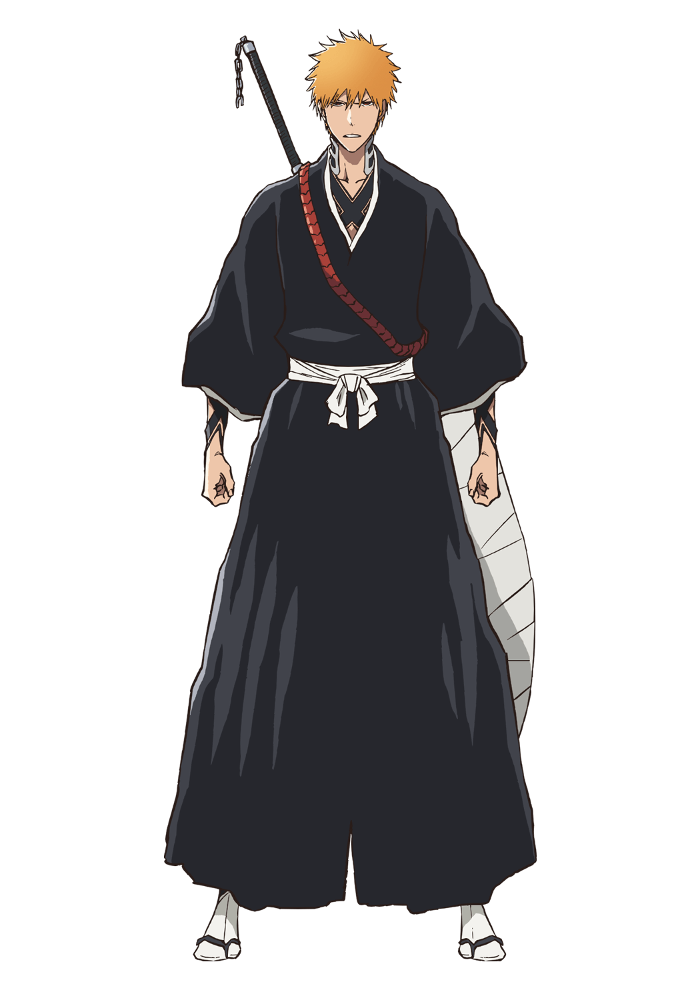 | CHR | Ichigo | full | id+outfit+color | bleach-anime.com | 1050/H/N | **P0 官方**全身立绘：标准死霸装+单刀斩月（已确认单刀形态）。chara_01.png |
| 037_char_identity_IchigoOfficialFace_v01.png 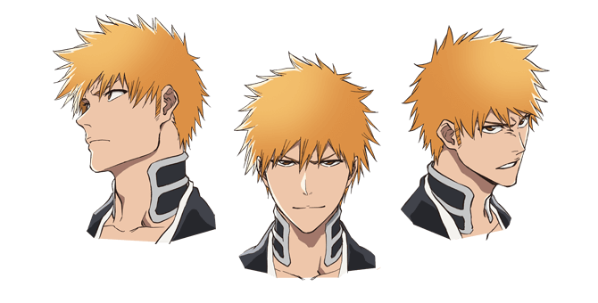 | CHR | Ichigo | front | id | bleach-anime.com | 340/L/N | **P0 官方**表情图：多表情面部参考，橙发棕瞳。URL 模式 face_01.png |
