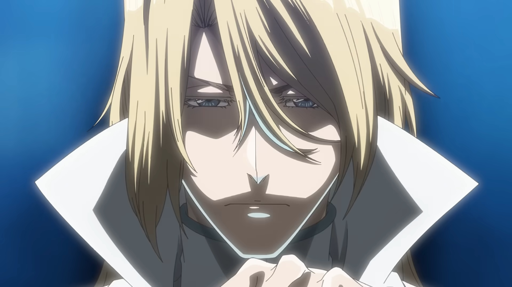
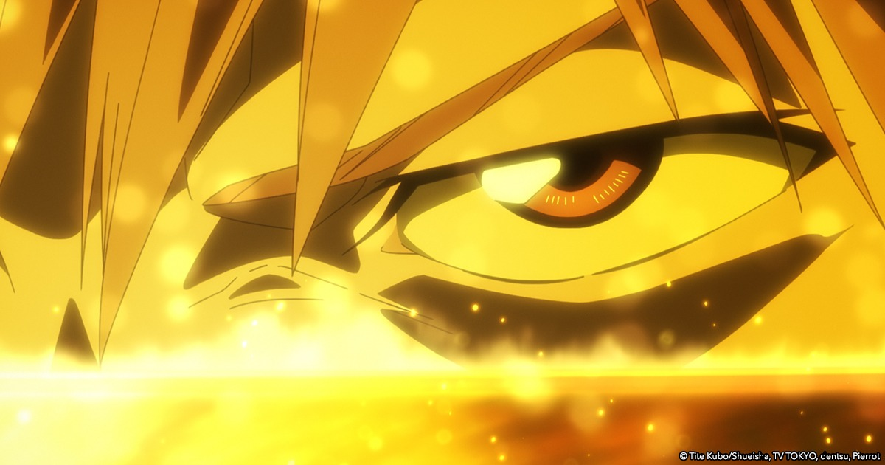
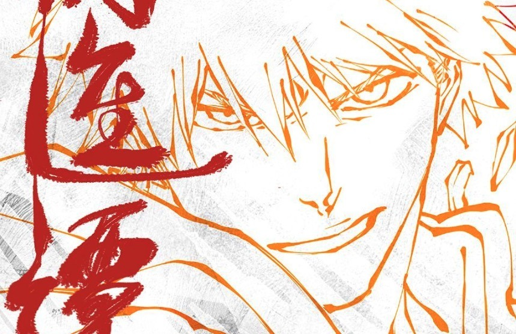
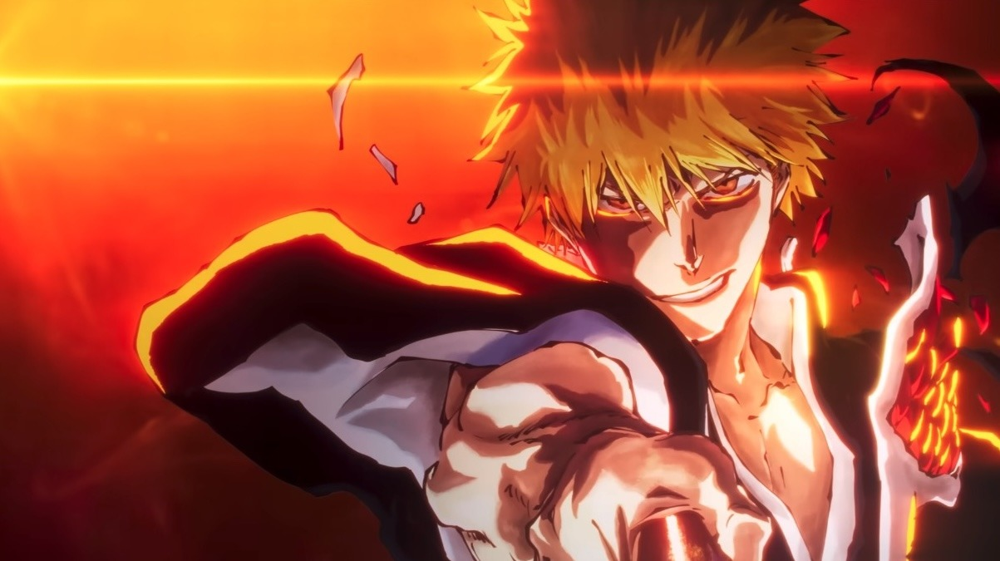
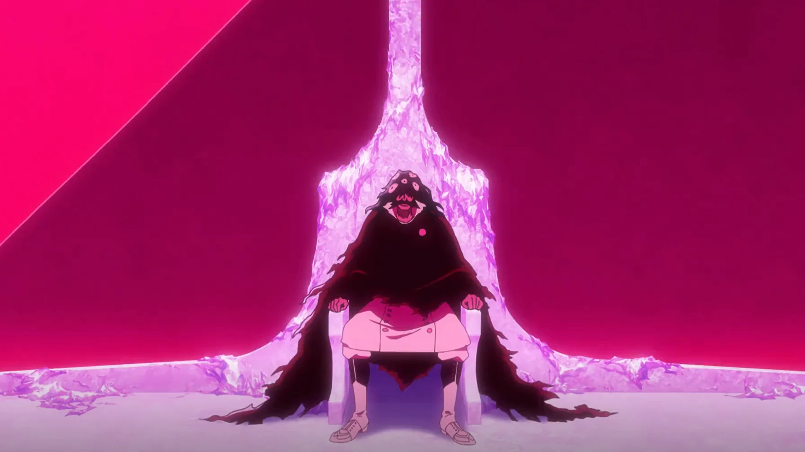
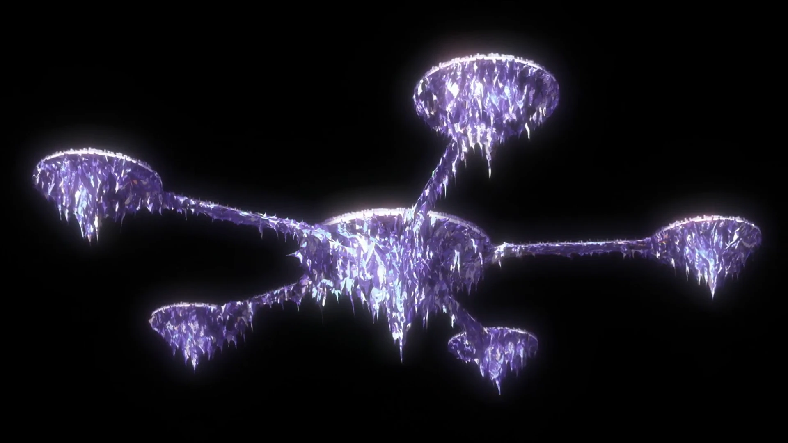
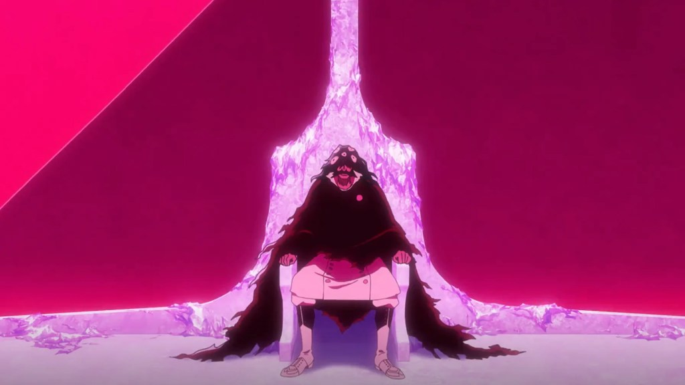
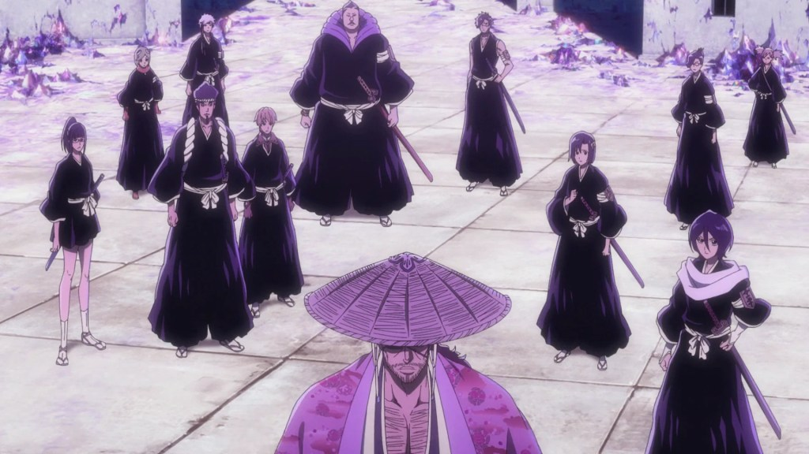
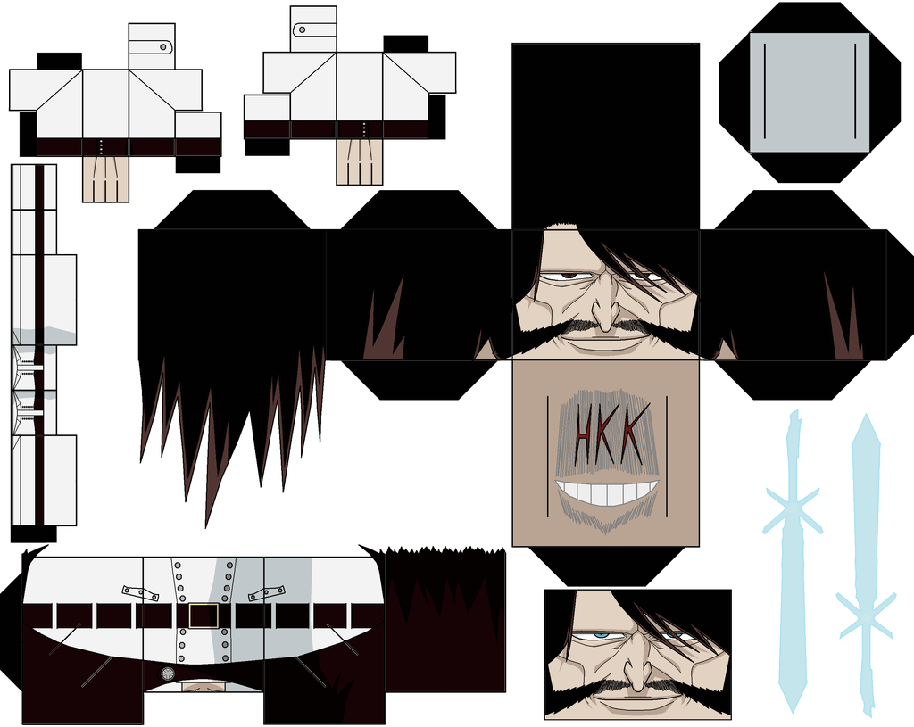

# T003 Yhwach 参考图来源记录

> 生成日期：2026-07-19
> 搜索工具链：WebSearch (Bing) + curl
> 搜索工具偏差：中 — WebSearch 返回的图文搜索结果以英文新闻站点为主，日文/中文来源命中率低。Danbooru/Pixiv/Zerochan 等图站完全未返回结果。

## 一、需求声明

- **角色**：Yhwach (友哈巴赫) — Bleach TYBW 篇最终 Boss
- **用途**：角色身份锚定（设定稿/动画截图/官方 key visual） + Seedream 布局参考
- **类型**：角色设计稿 > 官方 key visual > 动画截图 > 同人参考
- **质量门槛**：≥1024px（设定图）/ ≥512px（截图）
- **搜索范围**：英文/中文/日文关键词，P0–P3 多站点

## 二、搜索执行日志

### P0 — 官方来源

| 关键词 | 站点 | 命中? | 说明 |
|--------|------|-------|------|
| `Bleach TYBW official key visual Yhwach` | WebSearch | Y (文本) | 确认 Part 2/3/4 key visual 存在，但未返回直接图片 URL |
| `Yhwach Bleach official character design Masashi Kudo` | WebSearch | N | 未找到 Kudo 的 Yhwach 原画设定稿 |
| `bleach-anime.com character visual Yhwach` | WebSearch | N | 官方站点未直接返回可访问内容 |
| `BLEACH 千年血戦篇 ユーハバッハ 設定画 公式` | WebSearch | Y (文本) | 日文 Wikipedia 级别描述，无图片 |

**P0 总结**：所有官方站点（fandom wiki、bleach-anime.com、pierrot 官方）均被 Cloudflare 拦截。curl + 标准 User-Agent 无法访问。官方 key visual 图片通过新闻网站（OtakuUSA, Anime Corner）间接获取。

### P1 — 动画截图/新闻站点

| 关键词 | 站点 | 命中? | 说明 |
|--------|------|-------|------|
| `bleach calamity key visual otakuusamagazine` | curl | Y | 下载成功：Calamity KV (859x557)、Final Season KV (1203x675)、Part 3 截图 (1200x630) |
| `bleach tybw part 2 key visual animecorner` | curl | Y | 下载成功：Part 2 KV 全尺寸 (1920x1080) — 最佳单张 Yhwach 参考图 |
| `Yhwach bleach wiki image gallery` | WebSearch | Y (文本) | 确认文件名：Ep390YhwachProfile.png, 626Yhwach reveals.png 等，但文件路径被 Cloudflare 拦截 |
| `bleach fandom wiki Yhwach` | curl | N (Cloudflare) | 全部请求被 Cloudflare 防护拦截 |
| `sportskeeda bleach tybw part 2 key visual` | WebFetch | N | 域名被安全策略限制 |
| `comicbook.com bleach brave souls yhwach` | curl | N | 无响应 |

### P3 — 同人/社区站点

| 关键词 | 站点 | 命中? | 说明 |
|--------|------|-------|------|
| `Yhwach deviantart download` | WebSearch | Y (文本) | 找到 HAOROKU 等画师作品，但 DeviantArt 需登录才能下原图 |
| `Yhwach supercoloring paper craft` | curl | Y | 下载成功：纸模 PNG (1024x815) — 基础体态参考 |
| `Yhwach danbooru` | WebSearch | N | Danbooru 未返回任何结果 |
| `Yhwach tensor.art` | WebSearch | Y (文本) | Tensor.Art 有 Yhwach LoRA 模型，无法直接下载 |

## 三、素材清单

### 最佳角色参考图

| 文件 | 类型 | 用途 | 来源 | 来源性质 | 版权 | 验证状态 | 质量 |
|------|------|------|------|---------|------|---------|------|
| `Yhwach_design-sheet_v01.png`（已删除） | 角色 | 身份锚定+布局参考 | 本地 AI 生成（T003-P0-reference-prompts 产出） | AI生成 | 内部参考 | 未验证 | 2496x1664 — 三视图组合帧（**2026-07-19 compact 清除**） |
| `Yhwach_front_v01.png`（已删除） | 角色 | 身份锚定 | 本地 AI 生成 | AI生成 | 内部参考 | 未验证 | 2048x2048 — 正面肖像（**2026-07-19 compact 清除**） |
| 002_keyvisual_TYBW_Part2_Yhwach_Uryu_v01.jpg<br /> | 角色+场景 | 身份锚定+风格参考 | `static.animecorner.me/2023/07/bleach-tybw-part-2-visual.jpg` | 官方KV（新闻源） | 个人参考 | 已直接验证 | 1920x1080 — Yhwach 顶部构图，服装+体态清晰 |
| 004_scene_TYBW_Part3_IchigoYhwach_v01.jpg<br /> | 角色 | 场景+角色参考 | `otakuusamagazine.com/wp-content/uploads/2025/02/BL_TYBW_part3_EST_screens_1200x630_3.jpg` | 官方截图（新闻源） | 个人参考 | 已直接验证 | 1200x630 |
| 005_scene_identity_TYBWCalamity_Yhwach_v01.jpg<br /> | 角色+场景 | 身份锚定 | `otakuusamagazine.com/wp-content/uploads/2025/07/bleach-calamity1.jpg` | 官方KV（新闻源） | 个人参考 | 已直接验证 | 859x557 |
| 006_scene_identity_TYBWFinalSeason_v01.jpg<br /> | 场景 | 场景定调 | `otakuusamagazine.com/wp-content/uploads/2024/12/bleach-final-season-announce1.jpg` | 官方KV（新闻源） | 个人参考 | 已直接验证 | 1203x675 |

### 补充场景参考（并行过程产出）

| 文件 | 类型 | 用途 | 来源 | 来源性质 | 版权 | 验证状态 |
|------|------|------|------|---------|------|---------|
| 010_scene_look_full_yhwach_v01.webp<br /> | 场景 | Yhwach Wahrwelt 场景 | 不明（并行过程） | 官方视觉 | 个人参考 | 未独立验证 |
| 010_scene_look_full_wahrwelt_v01.webp<br /> | 场景 | Wahrwelt 冰宫场景 | 不明（并行过程） | 官方视觉 | 个人参考 | 未独立验证 |
| 004_scene_look_YhwachWahrwelt_v01.webp<br /> | 场景 | Yhwach Wahrwelt 站立 | 不明（并行过程） | 官方视觉 | 个人参考 | 未独立验证 |
| 005_scene_look_SeireiteiRuins_v01.webp<br /> | 场景 | 瀞灵廷废墟 | 不明（并行过程） | 官方视觉 | 个人参考 | 未独立验证 |
| 003_scene_look_WahrweltPalace_v01.webp<br /> | 场景 | Wahrwelt 宫殿 | 不明（并行过程） | 官方视觉 | 个人参考 | 未独立验证 |
| 001_scene_identity_BleachCour3KeyVisual_v01.jpeg<br /> | 场景 | Cour 3 KV | 不明（并行过程） | 官方KV | 个人参考 | 未独立验证 |

### 基础体态参考

| 文件 | 类型 | 用途 | 来源 | 来源性质 | 版权 | 验证状态 |
|------|------|------|------|---------|------|---------|
| 001_char_identity_YhwachPapercraft_v01.png<br /> | 角色 | 体态比例参考 | `cdn.supercoloring.com/paper_craft/580570/yhwach-paper-toy-paper-craft-original.png` | 同人纸模 | 个人参考 | 已直接验证 |

## 四、未命中记录

| 搜索内容 | 未命中原因 | 影响 |
|---------|-----------|------|
| Fandom wiki 所有 Yhwach 图片 | Cloudflare Anti-Bot | 官方动画截图不可直接获取 |
| Pixiv/Danbooru/Zerochan 角色图 | WebSearch 未返回有效链接 | 高质量同人参考缺失 |
| Official bleach-anime.com 素材 | 域名未返回可访问内容 | 官方设定图不可直接获取 |
| ArtStation 角色设计表 | 付费墙 | 布局参考图需购买 |
| DeviantArt 原图 | 需要登录才能下载原尺寸 | HAOROKU 等作品只能预览 |
| Comicbook.com Brave Souls Yhwach | 域名不可访问 | Brave Souls 首个动画风格 Yhwach 图缺失 |

## 五、关键发现

1. **P0 来源完全不可达**：Fandom/官方网站全部 Cloudflare 防护，curl/WebFetch 均不可穿透。find-ref skill 的 P0 策略在此类 IP 时代收集中实际不可执行。

2. **最佳命中是 P1 新闻站点**：OtakuUSA Magazine 和 Anime Corner 的 CDN（`static.animecorner.me`, `otakuusamagazine.com/wp-content/uploads/`）可直接通过 curl 访问。新闻站点引用官方素材时附带全尺寸图片。

3. **WebSearch 搜索偏差明显**：日文/中文关键词搜索结果显著少于英文，图像类站点（Danbooru/Pixiv）几乎不返回结果。搜索结果以文章和百科页面为主，图片 URL 很少直接暴露。

4. **现有 AI 生成素材可用作布局参考**：本地已有的 `Yhwach_design-sheet_v01.png`（2496x1664）可能是三视图组合帧，可满足 Seedream 布局参考需求。

5. **级联污染风险：低** — 下载来源均为已建立的正规新闻媒体（OtakuUSA Magazine, Anime Corner），非 AI 生成内容。但部分补充场景图来源不明，标记为"未独立验证"。

## 六、Seedream 布局参考

### 正参考（角色设计稿布局模板）

| 文件 | 用途 | 说明 |
|------|------|------|
| `027_lyt_layout_ThreeColumnCharSheet_v01.png` | 三栏角色设计稿布局 | Seedream 5.0 Pro 生成。左肖像+中3/4面+右全身。泛用角色填充，不参与身份锚定 |
| `002_keyvisual_TYBW_Part2_Yhwach_Uryu_v01.jpg` | 画风锁定参考 | 仅传递 Seedream 动漫画风质量，不参与角色身份 |

### 负参考

- 无。所有文件均与 T003 Bleach TYBW 风格一致。

### 布局参考使用方式

```
Seedream reference_image_url[0] = 027_lyt_layout（空间格式）
Seedream reference_image_url[1] = CHR 角色参考图（身份锚定）
Seedream prompt = 目标角色描述（替代填充角色）
```

### gate 参考图声明

```
参考图声明（LYT 布局参考图 — 2026-07-19 生图确认门通过）：
  正参考1：ref-images/027_lyt_layout_ThreeColumnCharSheet_v01.png（三栏角色设计稿布局模板。ai:Seedream。用途=layout）
  画风参考：ref-images/002_keyvisual_TYBW_Part2_Yhwach_Uryu_v01.jpg（官方 KV，仅画风锁定。用途=style）
  角色身份注：027 LYT 的角色内容为泛用填充。后续 Yhwach/Ichigo 生图时用 CHR 参考图覆盖角色身份
```
