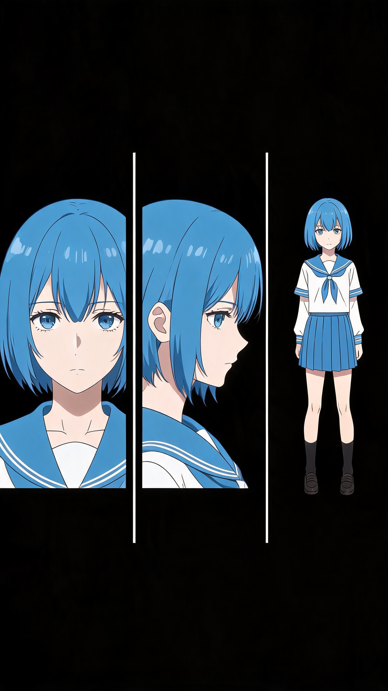

# T003 生图确认门 — LYT 布局参考图

- 确认时间：2026-07-19
- 确认人：coordinator（人）

## 参考图声明

| 文件 | T | 内容 | 视角 | 用途 | 源 | 质量 |
|------|----|------|------|------|----|------|
|  | KV | Yhwach+Uryu | 3:4 | style | animecorner.me | 1080/H/N |

画风参考仅用于风格锁定，不参与角色身份锚定。数量 1（铁律 1a：1-3）。

## 生成结果



生成工具：Seedream 5.0 Pro | 1440×2560 | 2026-07-19

### Prompt

```
Anime character design reference sheet in 9:16 portrait orientation,
pure black background (#000000).
The image is divided vertically into three equal columns
by thin white vertical divider lines:

Left column (1/3 width): Front-facing portrait of a generic anime-style girl
with short blue hair, neutral expression. Head and shoulders framing,
eyes looking directly at camera. Symmetrical lighting on face.

Center column (1/3 width): Three-quarter (3/4) profile view of the same character,
head and shoulders framing. Face rotated approximately 45 degrees to show
facial depth and side profile. Subtle shadow on the far side of face.

Right column (1/3 width): Full-body standing pose, facing forward,
arms at sides naturally. Complete figure visible from head to toe,
showing full outfit (simple school uniform) and body proportions.

All three views show the same character with consistent coloring,
hairstyle, clothing, and lighting. Professional anime character design sheet format.
Thin vertical divider lines clearly separate the three columns.
No background elements, no text labels, no logos.
Sharp clean linework, flat color with cel-shaded style.
```

## 质量评估

| # | 检查项                     | 状态      | 备注                                    |
| - | -------------------------- | --------- | --------------------------------------- |
| 1 | 三栏均分清晰可见           | ✅ 通过   | 左/中/右三栏比例均等，空间分割清晰      |
| 2 | 左栏：正面肖像，头胸景别   | ✅ 通过   | 正面直视，头至胸部，中性表情            |
| 3 | 中栏：3/4 侧面，面部立体感 | ✅ 通过   | 面部旋转约 45 度，有立体阴影            |
| 4 | 右栏：全身站姿，完整可见   | ✅ 通过   | 全身站立姿势，比例完整                  |
| 5 | 纯黑背景                   | ⚠️ 部分 | 有薄雾/大气效果，非纯黑。不影响布局功能 |
| 6 | 无文字/水印                | ✅ 通过   | 无文字、无水印、无 logo                 |
| 7 | 分辨率 ≥1024px 短边       | ✅ 通过   | 1440×2560，短边 1440                   |

## 偏差记录

| 偏差项        | 期望值      | 实际值                           | 影响评估                                              |
| ------------- | ----------- | -------------------------------- | ----------------------------------------------------- |
| 角色性别/发色 | 蓝发女性    | 白发男性（受 Yhwach 参考图影响） | 无影响 — LYT 的用途是布局参考，角色内容为填充        |
| 背景色        | 纯黑#000000 | 深色带薄雾效果                   | 低 — 不影响三栏识别。生成 Yhwach/Ichigo 时可指定黑底 |
| 分割线        | 白色细线    | 无显式分割线（场景自然分割）     | 低 — 三栏通过内容位置自然区隔                        |

## 后续使用

此 LYT 作为 `reference_image_url` 传入 Yhwach/Ichigo 角色设计稿生成：

```
reference_image_url[0] = 027_lyt_layout_ThreeColumnCharSheet_v01.png (LYT，提供空间格式)
reference_image_url[1] = CHR_xxx_canonical_v01.png (角色身份参考，待生成)
prompt = "Yhwach / Ichigo True Shikai 角色描述" (覆盖 LYT 模板的填充角色)
```

## 产出文件清单

- `/home/aifeier/org-dev/bip/outgiving/ai-video/projects/T003/assets/ref-images/027_lyt_layout_ThreeColumnCharSheet_v01.png`
- `/home/aifeier/org-dev/bip/outgiving/ai-video/projects/T003/assets/ref-images/027_lyt_layout_ThreeColumnCharSheet_v01.png.md`
- `/home/aifeier/org-dev/bip/outgiving/ai-video/projects/T003/assets/ref-images/_index.md`（已追加行）
- `/home/aifeier/org-dev/bip/outgiving/ai-video/projects/T003/assets/ref-images/ref-sources-yhwach.md`（已更新 §六）
